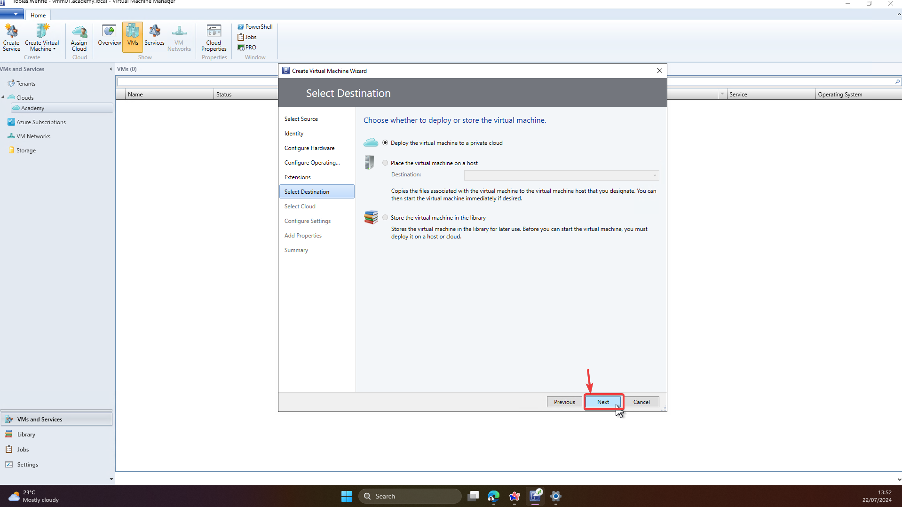
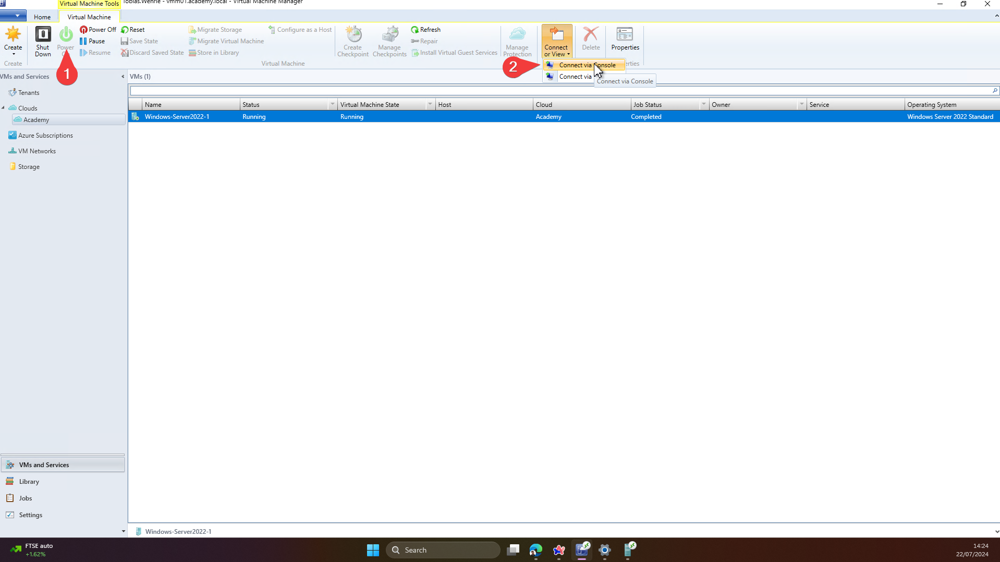

- [x] DHCP
  - [x] Wiederholung: fokus auf DORA und was macht ein DHCP
- [x] VMs
  - [x] Mit Hypervisor
- [x] Netzwerkaufbau visualisieren und erläutern
  - [x] Excalidraw Diagram
  - [x] Mit Hypervisor
- [ ] Debugging Netzwerke
  - [ ] Im Hypervisor
- [ ] (TCP/IP)
  - [ ] Wiederholung Theorie
  - [ ] TCP und UDP in VM
- [ ] OSI-Modell
  - [ ] Wiederholen
- [x] IPV4
  - [x] Wiederholen
- [ ] Netzlaufwerke und Fileserver einrichten
- [ ] Security Baselines - Windows Firewall

## Installation einer Windows Server 2022 Desktop VM mit SCVMM mit Template

Die folgende Anleitung bezieht sich auf die Arbeit mit VM-Templates. Wenn ein Gast-Betriebssystem manuell installiert werden soll, dann muss man zusätzliche Schritte beachten.

Hinweis: Falls ihr gewisse Zeichen nicht eingeben könnt, ist das Tastaturlayout wahrscheinlich auf EN-US eingestellt. Wenn ihr das `P@ssword` eingebt, nutzt `shift+2` für das `@` Zeichen.

### VM Starten

### Windows Admin Center for Windows Server 2022

Mehr Infos zum Admin-Center [hier](https://learn.microsoft.com/en-gb/windows-server/manage/windows-admin-center/overview).

### Rack-Server

#### 19 Zoll Rack 

### Server Formfactors

- Werden in U gemessen => 1-4 Units
- Zusätzlich gibt es noch einige andere Sonderformen von Servern
  - Blade-Server
  - Workstation Tower Server

#### 4U Server

#### 1U Server

#### Workstation

## Hypervisor

### Warum Hypervisor

- Serverauslastung maximieren
- Eine voll-ausgerüstete Maschine ist für die meisten Kunden nicht notwendig, oder bezahlbar.

#### Beispiele Typ1-Hypervisor

Ein Typ1 Hypervisor ist Quasi ein Betriebssystem für die Server-Hardware.

- VMWare ESXi

#### Beispiele Typ2-Hypervisor

- VMWare Workstation Pro & VMWare Fusion Pro
- Hyper-V -> Funktioniert nur auf Windows Hosts
- Oracle VirtualBox
- Linux => KVM (Kernel-Virtual-Machine), QEMU

## IPV4

s. Excalidraw

## DHCP

## IPv4-Networking

- 198.168.1.0 => Häufig default für Heimnetze (Home-Router wie Fritzbox), meist allerdings mit /16 Subnet
- CIDR => RFC 1519 (Deprecated) => RFC 4632
- Private Address Spaces => RFC 1918 (noch relevant, aber Addressklassen durch CIDR deprecated s. RFC 4632)
- RFC 1
	- Steve D. Crocker

